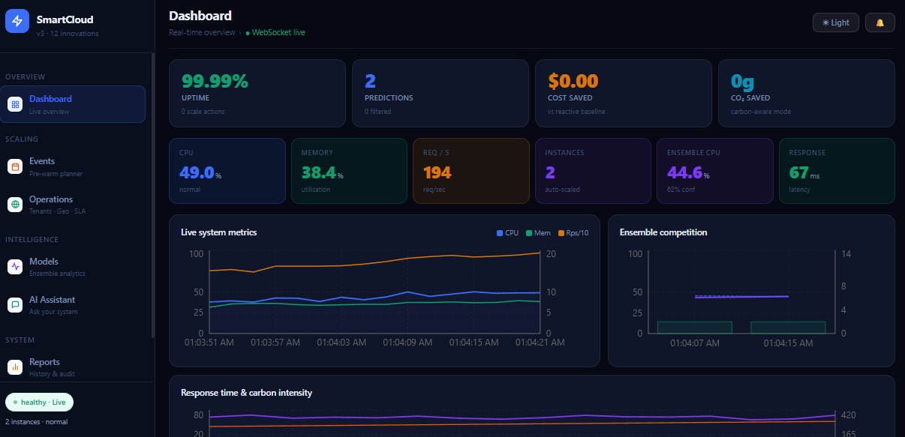
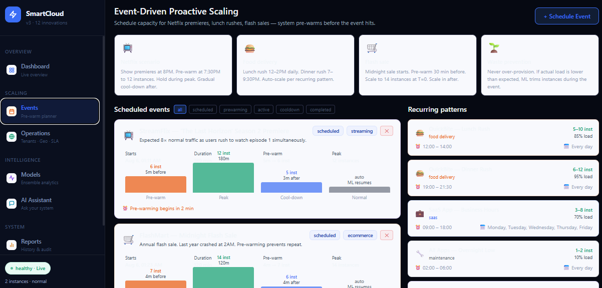

# SmartCloud v3 - Adaptive Predictive Auto-Scaling

SmartCloud v3 is a Dockerized cloud operations dashboard that simulates predictive auto-scaling, anomaly detection, SLA risk forecasting, cost tracking, and carbon-aware scaling decisions.

The project includes a FastAPI backend, a React/Vite frontend, and Prometheus configuration for metrics scraping.

## Features

- Adaptive ensemble forecasting using LSTM, ARIMA, and Holt-Winters style models
- SLA, cost, and carbon-aware scaling decision engine
- FFT-based workload fingerprinting and pattern memory
- Explainable anomaly detection with root-cause labels
- Real-time dashboard views for metrics, predictions, incidents, and scaling events
- Event-driven simulation scenarios for realistic traffic spikes
- Prometheus-ready backend metrics endpoint

## Screenshots

### Dashboard



### AI Ops Assistant



## Project Structure

```text
.
|-- backend/          # FastAPI API, simulation engine, ML/scaling models
|-- frontend/         # React + Vite dashboard
|-- prometheus/       # Prometheus scrape configuration
|-- docker-compose.yml
|-- start.bat         # Windows startup helper
|-- start.sh          # macOS/Linux startup helper
`-- stop.bat          # Windows stop helper
```

## Prerequisite

Install and start Docker Desktop:

https://www.docker.com/products/docker-desktop/

## Quick Start

### Windows

Double-click `start.bat`, or run:

```bat
start.bat
```

### macOS / Linux

```bash
bash start.sh
```

The first build may take several minutes.

## Local URLs

| Service | URL |
| --- | --- |
| Dashboard | http://localhost:3000 |
| API docs | http://localhost:8000/docs |
| Prometheus | http://localhost:9090 |

## Stop Services

### Windows

```bat
stop.bat
```

### macOS / Linux

```bash
docker-compose down
```

## Notes

- This repository does not include API keys, credentials, `.env` files, or private certificates.
- The frontend AI assistant currently calls Anthropic's API endpoint directly but does not include an API key. For production use, route AI requests through the backend and store provider keys in environment variables.
- Backend CORS is permissive for local/demo use. Restrict allowed origins before deploying publicly.
